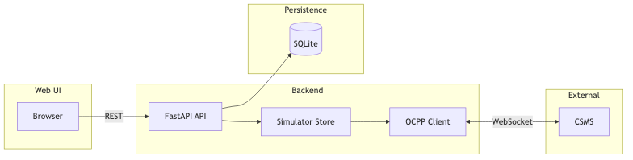

# Architecture

The OCPP Charger Simulator is a standalone application that simulates one or more OCPP 1.6J charge points and connects to any OCPP 1.6J CSMS over WebSocket. This document describes the system design, components, and data flow.

## Stack

- **Backend:** Python 3.11+, FastAPI
- **Frontend:** React, Vite, TypeScript
- **Database:** SQLite with Alembic migrations
- **CSMS communication:** WebSocket (OCPP 1.6 JSON)

## High-level flow

*Diagram source: [diagrams/architecture.mmd](diagrams/architecture.mmd). Run `npm run docs:pdf` to regenerate the image from the Mermaid source.*

- The **UI** talks to the backend via REST (e.g. list chargers, connect/disconnect, start/stop transactions).
- The **backend** keeps an in-memory simulator store of charge points and uses the database for persistence (chargers, EVSEs, locations, vehicles).
- Each **charger** has an OCPP client that maintains a WebSocket connection to the CSMS and exchanges OCPP 1.6 messages (BootNotification, StatusNotification, transactions, MeterValues, Heartbeat, configuration, remote start/stop).

## Backend components

| Component | Path | Role |
|-----------|------|------|
| FastAPI app | `backend/main.py` | Mounts API routes, CORS, startup (migrations, load chargers from DB). |
| API layer | `backend/api/` | Routers for health, locations, chargers, vehicles, import. |
| OCPP client | `backend/simulator_core/ocpp_client.py` | OCPP 1.6 charge point: sends Boot/Status/StartTx/StopTx/MeterValues/Heartbeat; handles Authorize, GetConfiguration, ChangeConfiguration, SetChargingProfile, RemoteStartTransaction, RemoteStopTransaction. |
| Charger | `backend/simulator_core/charger.py` | Charge point model: EVSEs, config, CSMS URL, optional vehicle resolver. |
| EVSE | `backend/simulator_core/evse.py` | Per-connector state machine and meter state (energy, power, SoC). Effective power is 0 when state is SuspendedEV or SuspendedEVSE, regardless of SetChargingProfile. |
| Meter engine | `backend/simulator_core/meter_engine.py` | Per-EVSE asyncio loop that updates meter state and sends MeterValues to the CSMS. When SoC reaches 100%, the EVSE transitions to SuspendedEV (StatusNotification sent) and the loop continues with 0 effective power until the session is stopped. |
| Store | `backend/simulator_core/store.py` | In-memory registry of chargers (by charge_point_id). |
| Config sync | `backend/simulator_core/config_sync.py` | Persists charger config to DB when the CSMS sends ChangeConfiguration. |

## Persistence

- **Chargers,** **EVSEs,** **locations,** and **vehicles** are stored in SQLite.
- On startup, the backend runs Alembic migrations and loads chargers from the DB into the simulator store.
- When the CSMS sends **ChangeConfiguration**, the backend updates the in-memory config and persists it to the DB (best-effort; persist failure is logged but the OCPP response can still be Accepted).

## API prefix

All API routes are under `/api` (e.g. `/api/health`, `/api/chargers`, `/api/locations`, `/api/locations/{id}/chargers`). The root `/` returns a short JSON with service name and links to docs and health.
