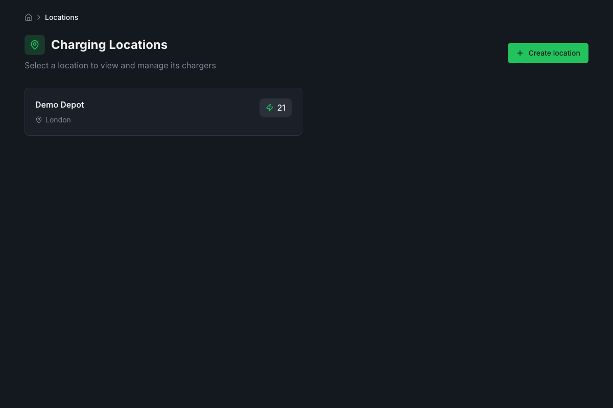
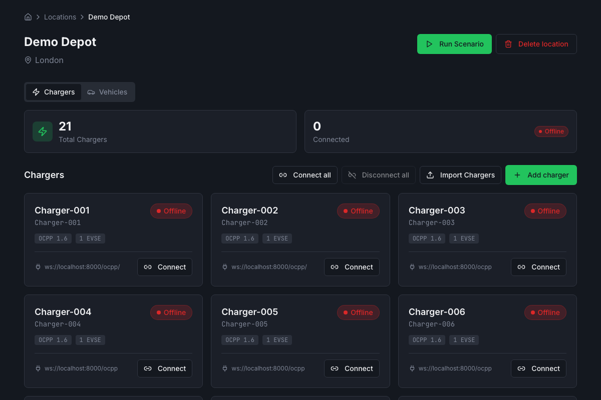
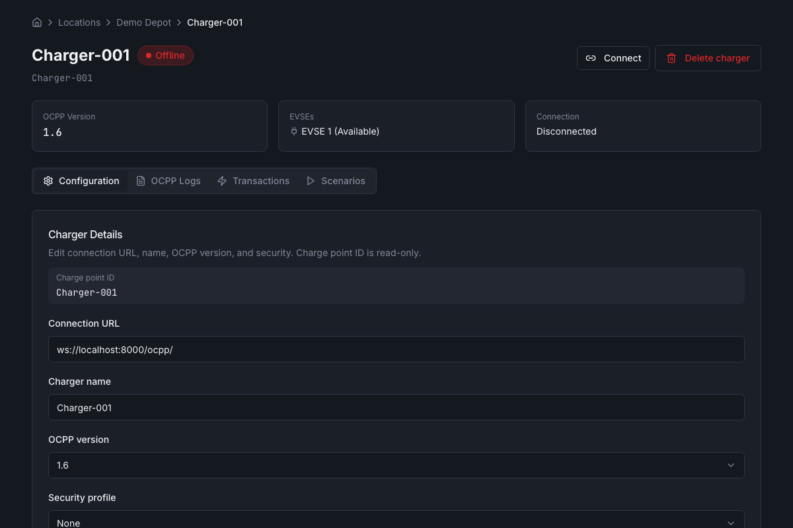

# UI Guide

This guide describes the web UI: routes, main screens, and how to perform common actions.

## Routes

| Path | Page |
|------|------|
| `/` | Location list |
| `/location/:locationId` | Location detail (chargers at that location) |
| `/location/:locationId/charger/:chargerId` | Charger detail |

## Location list

- **URL:** `/`
- **Purpose:** List all locations and open one to manage its chargers.

**Actions:**

1. **Create location** — Click "Create location", fill name and address, submit.
2. **Open a location** — Click a location card to go to its detail page.

## Location detail

- **URL:** `/location/:locationId`
- **Purpose:** View and manage chargers at this location; import chargers and vehicles.

**Actions:**

1. **Create charger** — Add a new charge point (charge_point_id, name, CSMS URL, etc.).
2. **Import chargers** — Upload CSV or JSON to create multiple chargers; templates are available from the API.
3. **Import vehicles** — Upload CSV or JSON to create vehicles (id_tag, battery capacity, etc.); templates are available.
4. **Open a charger** — Click a charger card to go to the charger detail page.

## Charger detail

- **URL:** `/location/:locationId/charger/:chargerId`
- **Purpose:** Connect to CSMS, configure the charger, start/stop transactions, view logs, and run scenarios (UI-only).

**Tabs:**

- **Configuration** — View and edit OCPP config keys (e.g. HeartbeatInterval, MeterValuesSampleInterval, OCPPAuthorizationEnabled).
- **Transactions** — Start a transaction (connector, id_tag, optional start SoC); stop a transaction (connector).
- **Logs** — OCPP log entries for this charger (incoming/outgoing messages).
- **Scenarios** — Predefined charging scenarios; **UI-only** (no backend scenario API). Start/stop and see progress in the UI.

**Actions:**

1. **Connect charger** — Start WebSocket connection to the configured CSMS URL; after connect, BootNotification and StatusNotifications are sent.
2. **Disconnect charger** — Close the WebSocket; charger stops sending Heartbeat and MeterValues.
3. **Start transaction** — Requires charger to be connected. Choose connector and id_tag (use an imported vehicle or any string); optional start SoC. The simulator sends Preparing, then Authorize (if OCPPAuthorizationEnabled), then StartTransaction; on success, MeterValues are sent at the configured interval.
4. **Stop transaction** — Select connector with an active transaction and stop; simulator sends StopTransaction and StatusNotification back to Available.
5. **Edit charger** — Change charger name, connection URL, or other metadata.
6. **Delete charger** — Remove the charger (after disconnect if connected).

## Main flows (step-by-step)

### Connect a charger

1. Go to a location → open a charger.
2. Ensure the charger has a valid **connection URL** (e.g. `ws://localhost:8000/ocpp/CP001` for your CSMS).
3. Click **Connect**. The button switches to "Disconnect" when connected; status shows connected.
4. The simulator sends BootNotification and StatusNotification per EVSE; the CSMS may send GetConfiguration, SetChargingProfile, etc.

### Start a transaction

1. Connect the charger (see above).
2. Open the **Transactions** tab.
3. Choose **Connector** (e.g. 1), enter **id_tag** (e.g. a vehicle id or any string).
4. Optionally set **Start SoC %** (default from vehicle or 20%).
5. Click **Start transaction**. If the CSMS accepts, the EVSE moves to Charging and MeterValues are sent periodically.
6. To stop, select the connector and click **Stop transaction**.

### Import chargers or vehicles

1. Go to **Location detail** for the desired location.
2. Click **Import chargers** or **Import vehicles**.
3. Upload a CSV or JSON file (or download a template first from the links provided).
4. Submit; the list updates with the new chargers or vehicles.
